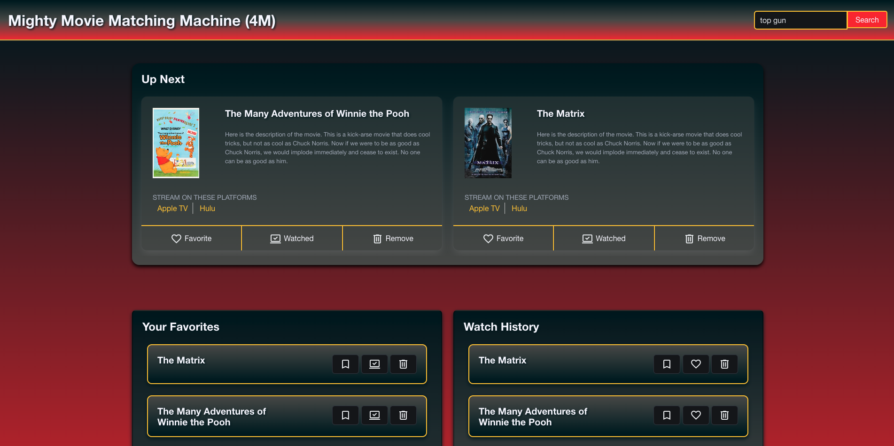
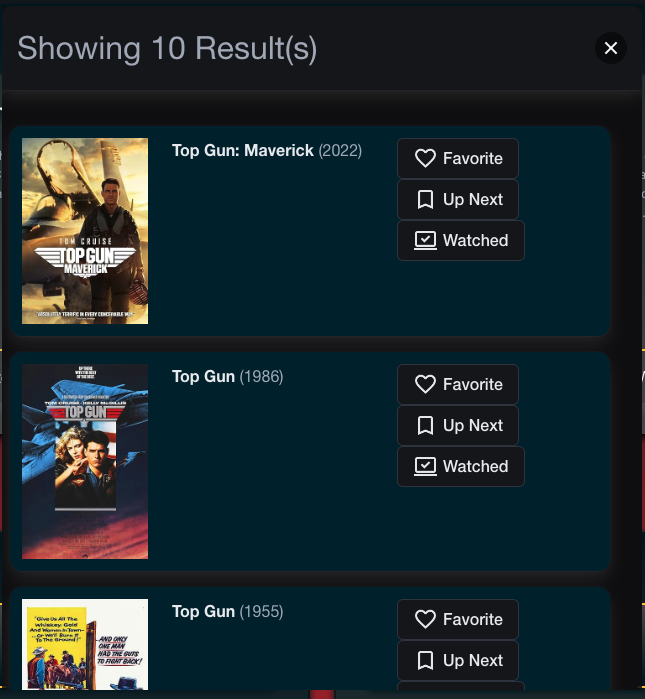

# Mighty Movie Matching Machine

## Purpose

The purpose of this project is to search for a movie and in the results, show functionality to add it as a favorite, add it to your up next list, or add it to your watched list.

In the Up Next list, more details about those movies will show descriptions and links to where you can stream or access that movie on the streaming services.

## Project Details

### MVP Requirements

Search for a movie of your choice and an api call will happen. It will display a list of results. User chooses an action on their movie selection. The choice will then add that to an array in localStorage to be accessed via each section. The second API is triggered in the Up Next section where it takes that selected movie and gets the list of streaming services.

### URLs

[GitHub Repo](https://github.com/mgordon82/mighty-movie-matching-machine)

[GitHub Pages](https://mgordon82.github.io/mighty-movie-matching-machine/)

[Presentation Link](https://docs.google.com/presentation/d/1R4z59963bT_Gs9YNWxQYChNULEn-ek6fKVqbQND5pmg/edit?usp=sharing)

### Screen Captures

## References
[WatchMode API](https://api.watchmode.com/)

[OMDB API](https://www.omdbapi.com/)

## Contributors

James

Nick

Elijah

Matt
